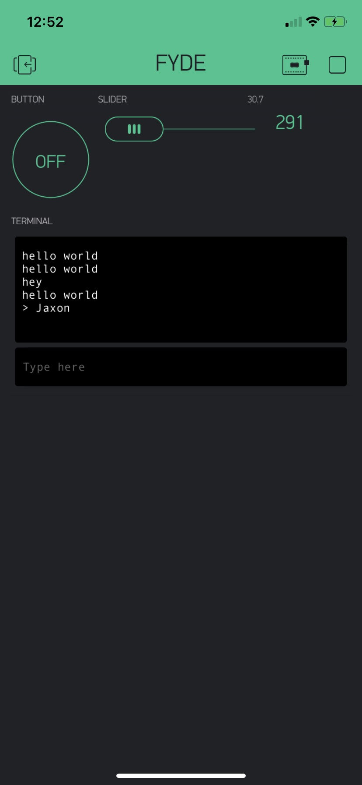

Name: Jaxon Coward

EID: jsc336

Team Number: 14

## Questions

1. What is the purpose of an IP address?

    To differentiate computers using IP communication

2. What is a DNS? What are the benefits of using domain names instead of IP addresses?

    Domain Name Servers. A directory of domain names and their IP addresses. Easier to read than IP addresses.

3. What is the difference between a static IP and a dynamic IP?

    Static IP's don't change. Dynamic IP's change and are assigned by the network

4. What is the tradeoff between UDP and TCP protocols?

    TCP ensures reception of sent data packets, UDP countinuously sends data even if it isn't received

5. Why can't we use the delay function with Blynk?

    Because it would get in the way of all the other routines running

6. What does it mean for a function to be "Blocking"?

    It stops all other routines

7. Why are interrupts useful for writing Non-Blocking code?

    Because they don't require your code to continuously check for a trigger event

8. What is the difference between interface and implementation? Why is it important?

   Interface is just a shell, like Blynk. Implementation is when we actually add functionality to that shell to make things happen.

9. Screenshot of your Blynk App:

    
